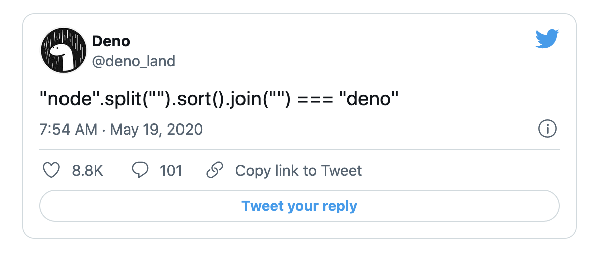
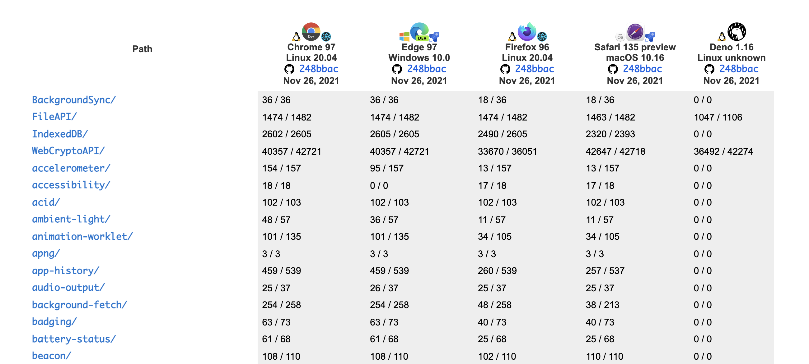
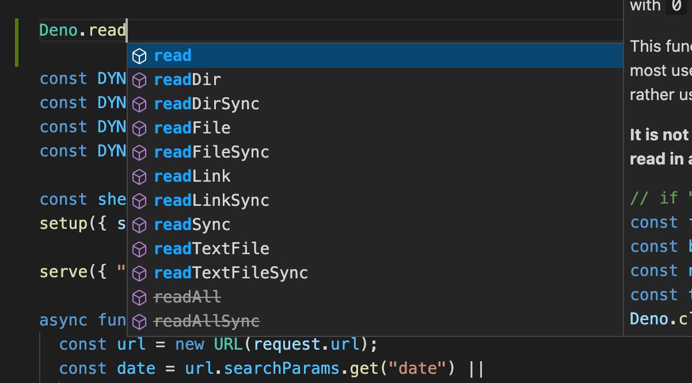
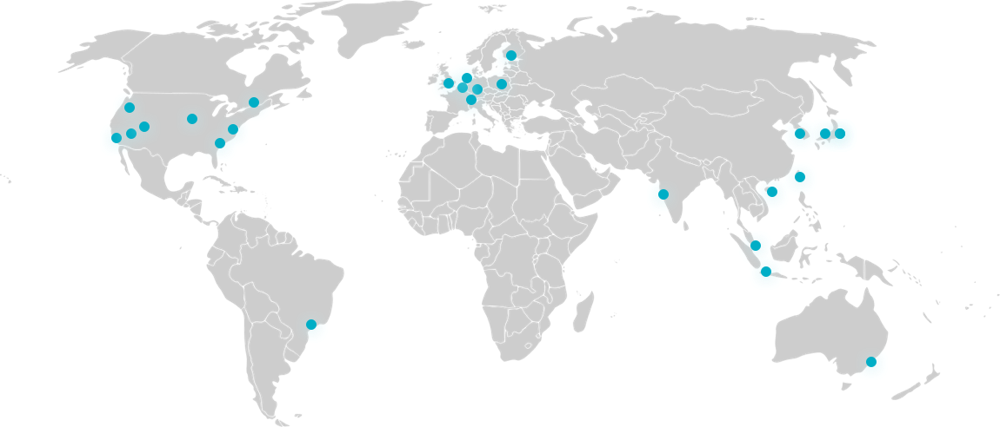

class: middle, center


Deno の話

---

アジェンダ

- Deno とは
- Deno の各種特徴
- Deno Deploy の紹介

---
# 話す人


日野澤歓也 twitter @kt3k

- GREE (2012 - 2013)
- Recruit (2015 - 2019)
- Deno Land (2021 -)

<small>2018年から Deno にコントリビュートを開始。2020年作者に誘われ Deno Land に転職。現在はフルタイムで Deno と Deno Deploy を開発中。</small>

---
class: middle center

Deno とは

---
class: inverse middle center

今から3年前

---
class: inverse middle center

とあるカンファレンス

---
class: jsconfeu2018

JSConf EU 2018

---
「Node.js について後悔している10の事」

- Node.js の作者 Ryan Dahl が Node.js の現状のデザインについて、今の視点からみて後悔している7つの事を発表
- それを克服する新しい処理系として Deno プロジェクトを提案

<p style="text-align: center">
  
</p>

---
7つの後悔

- 後悔1: Promise を使わなかった
- 後悔2: Security Sandbox を使わなかった
- 後悔3: GYP を使い続けてしまった
- 後悔4: package.json
- 後悔5: node_modules
- 後悔6: モジュール解決時の拡張子省略
- 後悔7: index.js

Node.js の「あたりまえ」を否定

---
対案としての Deno 、そのゴール

1. セキュリティ
2. ES Module
3. TypeScript ビルトイン
4. 単体の実行ファイルで動く
5. モダンな開発環境を使う
6. 可能な限り Web 互換

などの目標が掲げられた

---
class: middle center

Deno とは

---
class: middle center

Deno とは "改良版" Node.js

---
class: middle center



---
class: middle center
Deno の各種特徴

---
Deno の各種特徴
- Web 互換性
- TypeScript サポート
- V8 サンドボックスセキュリティの活用

---
class: inverse middle center

Web 互換性

---
Web 互換性

- Deno には可能な限り Web 互換 API を取り入れるというデザイン方針がある
- サーバーサイドでも意味がある Web API を出来るだけ取り入れる

---
Web 互換性

Deno に実装されている Web API の例

- http client - fetch API
- バイナリ処理 - TypedArray API (Uint8Array, etc)
- ストリーミング処理 - Web Stream API
- URL parse - URL API
- PubSub - EventTarget API

---
Web 互換性

Deno に実装されている Web API の例

- 暗号 - Web Crypto API
- GPU - WebGPU
- http server - Request, Response API
- データ保存 - Web Storage API

---
Web 互換性 - 最近の進捗 - WPT

- 2021年1月 Web Platform テストを CI に導入
- Web Platform Test = ブラウザが共通で通している Web API のテストスイート
- コミット毎に Web 互換性をチェックするように

<p class="text-align: center">
<a href="https://wpt.fyi/results/?label=master&product=chrome%5Bexperimental%5D&product=edge%5Bexperimental%5D&product=firefox%5Bexperimental%5D&product=safari%5Bexperimental%5D&product=deno&aligned">
</a>
</p>

---
Web 互換性 - 最近の進捗 - MDN

- 2021年8月 MDN への掲載が始まる

<p class="text-align: center">
  
</p>


---
class: inverse middle center

TypeScript サポート

---
TypeScript サポート

- TypeScript をそのまま実行できる。

```ts
// sample.ts
const res = await fetch("https://example.com")
console.log(res.body.text);
```

```
$ deno run sample.ts  
Check file:///Users/kt3k/sample.ts
error: TS2531 [ERROR]: Object is possibly 'null'.
console.log(res.body.text);
            ~~~~~~~~
```

↑ 実行時エラーではなく型エラー

---
TypeScript サポート - 最近の進捗

- 2020年8月 `deno lsp` コマンドの導入
- VSCode とシームレスな連携 & Deno 固有な型情報の補完が出来るように

<p class="text-align: center">
  
</p>

---
TypeScript サポート `deno lsp`

- ネットワーク越しの TypeScript も型補完が可能

<p class="text-align: center">
  
</p>

---
class: inverse middle center

サンドボックスセキュリティ

---
サンドボックスセキュリティ

前提の話

- Deno は内部的に V8 エンジンを使っている。
- ブラウザ上で JavaScript を安全に実行するため、V8 エンジンの実行環境は厳格にサンドボックス化されている。
- => V8 の外に影響を及ぼせないようになっている

---
サンドボックスセキュリティ

<p class="text-align: center">
  
</p>

---
サンドボックスセキュリティ

- V8 Sandbox から出て runtime の機能を使う際に opcallSync / opcallAsync という関数を必ず通るデザインになっている
- その際に使おうとしてる機能に即したパーミッションを持っているかどうかをチェックする

---
サンドボックスセキュリティ

- 7種類のパーミッションがあり、コマンドライン引数で渡す
- `--allow-read` ファイル読み取り
- `--allow-write` ファイル書き込み
- `--allow-net` ネットワーク
- `--allow-env` 環境変数読み取り
- `--allow-run` プロセス実行
- `--allow-ffi` ネイティブ拡張の使用を許可
- `--allow-hrtime` 高精度タイマーの使用を許可

---
サンドボックスセキュリティ

各セキュリティに範囲指定が実装されています

カレントディレクトリのみ読み込み許可
```
deno run --allow-read=. program.ts
```

`dist/` ディレクトリのみ書き込み許可

```
deno run --allow-write=dist/ program.ts
```

---
サンドボックスセキュリティ

特定のドメイン・ポートのみネットワークアクセス許可

```
deno run --allow-net=example.com:80 program.ts
```

※攻撃コードが混入してしまった時に威力を発揮

---
サンドボックスセキュリティ - 最近の進捗

AWS のクレデンシャルの環境変数のみ使用許可

```
deno run \
  --allow-env=AWS_ACCESS_KEY_ID,AWS_SECRET_ACCESS_KEY \
  program.ts
```

git コマンドだけ使用許可

```
deno run --allow-run=git program.ts
```

---
class: middle center

Deno のユニークなデザインは<br />一定の評価を受けつつある

---
Deno の採用例 - GitHub

次世代 Data Access API

<p style="text-align: center">
  <a href="https://next.github.com/projects/flat-data">
    
  </a>
</p>

---
Deno の採用例 - Jake Archibald

<p style="text-align: center">
  <a href="https://twitter.com/jaffathecake/status/1447900413609529347">
    
  </a>
</p>

---
Deno の採用例 - Slack

<p style="text-align: center">
  <a href="https://deno.com/blog/slack">
    
  </a>
</p>


---
class: middle center

Deno Deploy の紹介
---
Deno Deploy の紹介

- 2021年5月に Deno 社から Beta リリースされた "サーバーレスエッジコンピューティングサービス"
- 2022年前半に正式リリース予定

---
Deno Deploy の紹介

- Deno と互換な [API](https://deno.com/deploy/docs/runtime-api) (サブセット) を持ったランタイム環境

<small>例. Deno Deploy の Hello world プログラム</small>
```ts
import {
 serve
} from "https://deno.land/std@0.114.0/http/server.ts";

serve((_req) => new Response("Hello World!"));
```
<small><small>(Deno CLI でも同じコードでサーバーが立ち上がる)</small></small>

---
Deno Deploy の紹介

- 28リージョンへの自動デプロイ機能



<small>似たような事が可能なサービス: CF Workers, Lambda@Edge, CloudFront Functions, Vercel Edge Functions, etc</small>

---
Deno Deploy の紹介

- 外向き TCP コネクションが張れる
- Postgres, MySQL, Redis などと直接通信可能

---
他サービスとの比較 <small><small>(私見)</small></small>

- Deno Deploy はフルスタックアプリケーション指向
  - 似てる: CloudFlare Workers
  - 違う: Lambda@Edge, CloudFront Functions, Vercel Edge Functions
- 自動的にマルチリージョン展開できる
  - 似てる: CloudFlare Workers
  - 違う: AWS Lambda, GCP Cloud Functions

---
class: middle center

質問コーナー

---
_class: middle center inverse

Q. deno で型情報がないライブラリを入れる時って今は何を使うのがよいんすか? (reactとか)

--

A. react は esm.sh / skypack から import するのがおすすめです。

```ts
import React from "https://esm.sh/react";
```

---
_class: middle center inverse

Q. deno 本体って何言語で何を実装しているのですか?

--

A. Rust 🦀 です!

---
_class: middle center inverse

Q. JSConf の発表で deno 固有の型情報についての話があったと思うのですが、いま deno 固有のものってどういうものがあるのでしょうか？

--

A. [Deno 名前空間のドキュメント](https://doc.deno.land/deno/stable)

---
_class: middle center inverse

Q. deno deploy ってどうなっていくんですか。どう動いているんですか。

--

A. 2022年前半に正式リリース予定です<br />(pricing などもこのタイミングには出る想定です)

---
A. Denoのコアチームは企業のメンバーが中心ということになりましたが、今後Deno Company外のContributors とはどう連携を取っていく予定ですか？

--

Q. コアチームが決めた事が必ず通るというわけでは無く、あくまでコミュニティとして意思決定をするという立場をとっています。

- 例. [Deprecate "deno bundle"](https://github.com/denoland/deno/issues/11073)

---
A. どうしても企業が管理するOSSは(良くも悪くも)意思決定が内部に閉じたミーティングなどで行われるケースがあると思っていて、そういった情報や意思決定の場をどの程度コミュニティにオープンにしていくか知りたいです。

--

Q. 内部での意思決定があった場合はできる限り公開しています

- 参考 [デザインミーティングのノート](https://qiita.com/access3151fq/items/9ae02922723be2db199f#%E4%BB%8A%E5%BE%8C%E4%BA%88%E5%AE%9A%E3%81%95%E3%82%8C%E3%81%A6%E3%81%84%E3%82%8B%E5%A4%89%E6%9B%B4)

---
A. オープンなDenoとは別の、Deno Enterprise のようなものが生まれる可能性もあるのでしょうか？

--

Q. Deno カンパニーのアナウンスブログで、"Open Core" モデルは Deno にはそぐわない、という事が表明されており、有料版 Deno のようなものを作る事はない、という事が説明されています

- [Announcing the Deno Company](https://deno.com/blog/the-deno-company)

---
class: middle center


End
